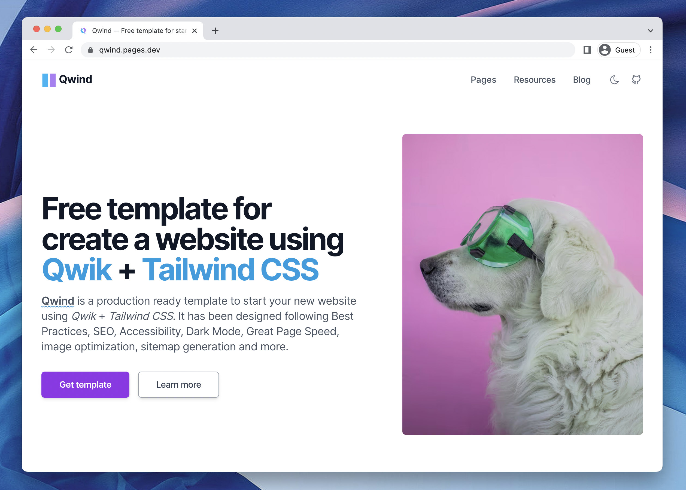

# 💠 Qwind

**Qwind** is a free and open-source template to make your website using **[Qwik](https://qwik.builder.io/) + [Tailwind CSS](https://tailwindcss.com/)**. Ready to start a new project and designed taking into account best practices.

## Features

- ✅ Integration with **Tailwind CSS** supporting **Dark mode**.
- ✅ **Production-ready** scores in [Lighthouse](https://web.dev/measure/) and [PageSpeed Insights](https://pagespeed.web.dev/) reports.
- ✅ **Image optimization** and **Font optimization**.

<br>



[](https://onwidget.com)
[](https://github.com/onwidget/qwind/blob/main/LICENSE.md)
[](https://github.com/onwidget)
[](https://github.com/onwidget/qwind#contributing)
[](https://snyk.io/test/github/onwidget/qwind)

<br>

<details open>
<summary>Table of Contents</summary>

- [Demo](#demo)
- [Getting started](#getting-started)
  - [Project structure](#project-structure)
  - [Commands](#commands)
  - [Configuration](#configuration)
  - [Deploy](#deploy)
- [Roadmap](#roadmap)
- [Contributing](#contributing)
- [Acknowledgements](#acknowledgements)
- [License](#license)

</details>

<br>

## Demo

📌 [https://qwind.pages.dev/](https://qwind.pages.dev/)

<br>

## Getting started

This project is using Qwik with [QwikCity](https://qwik.builder.io/qwikcity/overview/). QwikCity is just a extra set of tools on top of Qwik to make it easier to build a full site, including directory-based routing, layouts, and more.

### Project structure

Inside **Qwind** template, you'll see the following folders and files:

```
/
├── adaptors/
|   └── static/
|       └── vite.config.ts
├── public/
│   ├── favicon.svg
│   ├── manifest.json
│   └── robots.txt
├── src/
│   ├── assets/
│   │   ├── images/
|   |   └── styles/
|   |       └── global.css
│   ├── components/
│   │   ├── atoms/
│   │   ├── core/
│   │   ├── icons/
|   |   └── widgets/
|   |       ├── Header.astro
|   |       ├── Footer.astro
|   |       └── ...
│   ├── routes/
│   |   ├── blog/
│   |   ├── index.astro
|   |   ├── layout.tsx
|   |   └-- service-worker.ts
│   ├── config.mjs
│   ├── entry.dev.tsx
│   ├── entry.preview.tsx
│   ├── entry.ssr.tsx
│   └── root.tsx
├── package.json
└── ...
```

- `src/routes`: Provides the directory based routing, which can include a hierarchy of `layout.tsx` layout files, and an `index.tsx` file as the page. Additionally, `index.ts` files are endpoints. Please see the [routing docs](https://qwik.builder.io/qwikcity/routing/overview/) for more info.

- `src/components`: Recommended directory for components.

- `public`: Any static assets, like images, can be placed in the public directory. Please see the [Vite public directory](https://vitejs.dev/guide/assets.html#the-public-directory) for more info.

[](https://githubbox.com/onwidget/qwind/tree/main)

> **Seasoned qwik expert?** Delete this file. Update `config.mjs` and contents. Have fun!

<br>

### Commands

All commands are run from the root of the project, from a terminal:

| Command               | Action                                             |
| :-------------------- | :------------------------------------------------- |
| `npm install`         | Installs dependencies                              |
| `npm run dev`         | Starts local dev server at `127.0.0.1:5173/`       |
| `npm run build`       | Build your production site to `./dist/`            |
| `npm run preview`     | Preview your build locally, before deploying       |
| `npm run fmt`         | Format codes with Prettier                         |
| `npm run lint`        | Run Eslint                                         |
| `npm run qwik ...`    | Run CLI commands like `qwik add`, `qwik build` |

<br>

### Configuration

Basic configuration file: `./src/config.mjs`

```javascript
export const SITE = {
  name: 'Example',

  origin: 'https://example.com',
  basePathname: '/', // Change this if you need to deploy to Github Pages, for example
  trailingSlash: true, // Generate permalinks with or without "/" at the end
};
```

<br>

### Deploy

#### Deploy to production (manual)

You can create an optimized production build with:

```shell
npm run build
```

Now, your website is ready to be deployed. All generated files are located at
`dist` folder, which you can deploy the folder to any hosting service you
prefer.

#### Deploy to Netlify

Clone this repository on own GitHub account and deploy to Netlify:

[](https://app.netlify.com/start/deploy?repository=https://github.com/onwidget/qwind)

#### Deploy to Vercel

Clone this repository on own GitHub account and deploy to Vercel:

[](https://vercel.com/new/clone?repository-url=https%3A%2F%2Fgithub.com%2Fonwidget%2Fqwind)

<br>

## Roadmap

### Base
- [ ] Create utilities to generate permalinks tailored to the domain and base pathname.
- [ ] Simplify the way to optimize images.
- [ ] Create component to make SEO simpler and more intuitive.
- [ ] Create configurable blog with categories, tags and authors using MDX.
- [ ] Add more frequently used pages (Portfolio, Services, Contact, Docs ...).
- [ ] Find or create a library to have more icon sources available.
- [ ] Refactor some code that doesn't follow Qwik conventions yet.

### Advanced

- [ ] Achieve perfect 100% Google Page Speed score.
- [ ] Insert complex javascript example widget on home page to demonstrate Qwik features.
- [ ] Create small illustrative admin backend.

<br>

## Contributing

If you have any idea, suggestions or find any bugs, feel free to open a discussion, an issue or create a pull request.
That would be very useful for all of us and we would be happy to listen and take action.

## Acknowledgements

Initially created by [onWidget](https://onwidget.com) and maintained by a community of [contributors](https://github.com/onwidget/qwind/graphs/contributors).

## License

**Qwind** is licensed under the MIT license — see the [LICENSE](https://github.com/onwidget/qwind/blob/main/LICENSE.md) file for details.

## Cloudflare Pages

Cloudflare's [wrangler](https://github.com/cloudflare/wrangler) CLI can be used to preview a production build locally. To start a local server, run:

```
npm run serve
```

Then visit [http://localhost:8787/](http://localhost:8787/)

### Deployments

[Cloudflare Pages](https://pages.cloudflare.com/) are deployable through their [Git provider integrations](https://developers.cloudflare.com/pages/platform/git-integration/).

If you don't already have an account, then [create a Cloudflare account here](https://dash.cloudflare.com/sign-up/pages). Next go to your dashboard and follow the [Cloudflare Pages deployment guide](https://developers.cloudflare.com/pages/framework-guides/deploy-anything/).

Within the projects "Settings" for "Build and deployments", the "Build command" should be `npm run build`, and the "Build output directory" should be set to `dist`.

### Function Invocation Routes

Cloudflare Page's [function-invocation-routes config](https://developers.cloudflare.com/pages/platform/functions/function-invocation-routes/) can be used to include, or exclude, certain paths to be used by the worker functions. Having a `_routes.json` file gives developers more granular control over when your Function is invoked.
This is useful to determine if a page response should be Server-Side Rendered (SSR) or if the response should use a static-site generated (SSG) `index.html` file.

By default, the Cloudflare pages adaptor _does not_ include a `public/_routes.json` config, but rather it is auto-generated from the build by the Cloudflare adaptor. An example of an auto-generate `dist/_routes.json` would be:

```
{
  "include": [
    "/*"
  ],
  "exclude": [
    "/_headers",
    "/_redirects",
    "/build/*",
    "/favicon.ico",
    "/manifest.json",
    "/service-worker.js",
    "/about"
  ],
  "version": 1
}
```

In the above example, it's saying _all_ pages should be SSR'd. However, the root static files such as `/favicon.ico` and any static assets in `/build/*` should be excluded from the Functions, and instead treated as a static file.

In most cases the generated `dist/_routes.json` file is ideal. However, if you need more granular control over each path, you can instead provide you're own `public/_routes.json` file. When the project provides its own `public/_routes.json` file, then the Cloudflare adaptor will not auto-generate the routes config and instead use the committed one within the `public` directory.

## Cloudflare Pages

Cloudflare's [wrangler](https://github.com/cloudflare/wrangler) CLI can be used to preview a production build locally. To start a local server, run:

```
npm run serve
```

Then visit [http://localhost:8787/](http://localhost:8787/)

### Deployments

[Cloudflare Pages](https://pages.cloudflare.com/) are deployable through their [Git provider integrations](https://developers.cloudflare.com/pages/platform/git-integration/).

If you don't already have an account, then [create a Cloudflare account here](https://dash.cloudflare.com/sign-up/pages). Next go to your dashboard and follow the [Cloudflare Pages deployment guide](https://developers.cloudflare.com/pages/framework-guides/deploy-anything/).

Within the projects "Settings" for "Build and deployments", the "Build command" should be `npm run build`, and the "Build output directory" should be set to `dist`.

### Function Invocation Routes

Cloudflare Page's [function-invocation-routes config](https://developers.cloudflare.com/pages/platform/functions/function-invocation-routes/) can be used to include, or exclude, certain paths to be used by the worker functions. Having a `_routes.json` file gives developers more granular control over when your Function is invoked.
This is useful to determine if a page response should be Server-Side Rendered (SSR) or if the response should use a static-site generated (SSG) `index.html` file.

By default, the Cloudflare pages adaptor _does not_ include a `public/_routes.json` config, but rather it is auto-generated from the build by the Cloudflare adaptor. An example of an auto-generate `dist/_routes.json` would be:

```
{
  "include": [
    "/*"
  ],
  "exclude": [
    "/_headers",
    "/_redirects",
    "/build/*",
    "/favicon.ico",
    "/manifest.json",
    "/service-worker.js",
    "/about"
  ],
  "version": 1
}
```

In the above example, it's saying _all_ pages should be SSR'd. However, the root static files such as `/favicon.ico` and any static assets in `/build/*` should be excluded from the Functions, and instead treated as a static file.

In most cases the generated `dist/_routes.json` file is ideal. However, if you need more granular control over each path, you can instead provide you're own `public/_routes.json` file. When the project provides its own `public/_routes.json` file, then the Cloudflare adaptor will not auto-generate the routes config and instead use the committed one within the `public` directory.

## Express Server

This app has a minimal [Express server](https://expressjs.com/) implementation. After running a full build, you can preview the build using the command:

```
npm run serve
```

Then visit [http://localhost:8080/](http://localhost:8080/)

## Netlify

This starter site is configured to deploy to [Netlify Edge Functions](https://docs.netlify.com/edge-functions/overview/), which means it will be rendered at an edge location near to your users.

### Local development

The [Netlify CLI](https://docs.netlify.com/cli/get-started/) can be used to preview a production build locally. To do so: First build your site, then to start a local server, run:

1. Install Netlify CLI globally `npm i -g netlify-cli`.
2. Build your site with both ssr and static `npm run build`.
3. Start a local server with `npm run serve`.
   In this project, `npm run serve` uses the `netlify dev` command to spin up a server that can handle Netlify's Edge Functions locally.
4. Visit [http://localhost:8888/](http://localhost:8888/) to check out your site.

### Edge Functions Declarations

[Netlify Edge Functions declarations](https://docs.netlify.com/edge-functions/declarations/)
can be configured to run on specific URL patterns. Each edge function declaration associates
one site path pattern with one function to execute on requests that match the path. A single request can execute a chain of edge functions from a series of declarations. A single edge function can be associated with multiple paths across various declarations.

This is useful to determine if a page response should be Server-Side Rendered (SSR) or
if the response should use a static-site generated (SSG) `index.html` file instead.

By default, the Netlify Edge adaptor will generate a `.netlify/edge-middleware/manifest.json` file, which is used by the Netlify deployment to determine which paths should, and should not, use edge functions.

To override the generated manifest, you can [add a declaration](https://docs.netlify.com/edge-functions/declarations/#add-a-declaration) to the `netlify.toml` using the `[[edge_functions]]` config. For example:

```toml
[[edge_functions]]
  path = "/admin"
  function = "auth"
```

### Deployments

You can [deploy your site to Netlify](https://docs.netlify.com/site-deploys/create-deploys/) either via a Git provider integration or through the Netlify CLI. This starter site includes a `netlify.toml` file to configure your build for deployment.

#### Deploying via Git

Once your site has been pushed to your Git provider, you can either link it [in the Netlify UI](https://app.netlify.com/start) or use the CLI. To link your site to a Git provider from the Netlify CLI, run the command:

```shell
netlify link
```

This sets up [continuous deployment](https://docs.netlify.com/site-deploys/create-deploys/#deploy-with-git) for your site's repo. Whenever you push new commits to your repo, Netlify starts the build process..

#### Deploying manually via the CLI

If you wish to deploy from the CLI rather than using Git, you can use the command:

```shell
netlify deploy --build
```

You must use the `--build` flag whenever you deploy. This ensures that the Edge Functions that this starter site relies on are generated and available when you deploy your site.

Add `--prod` flag to deploy to production.
